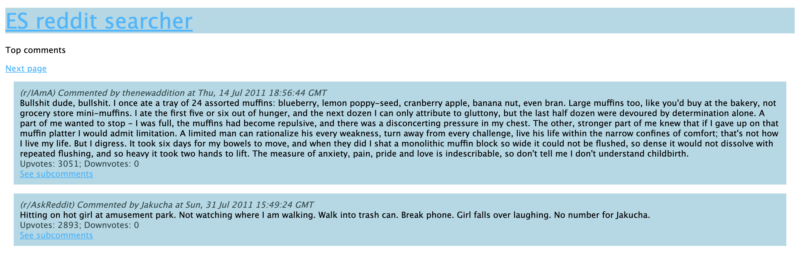
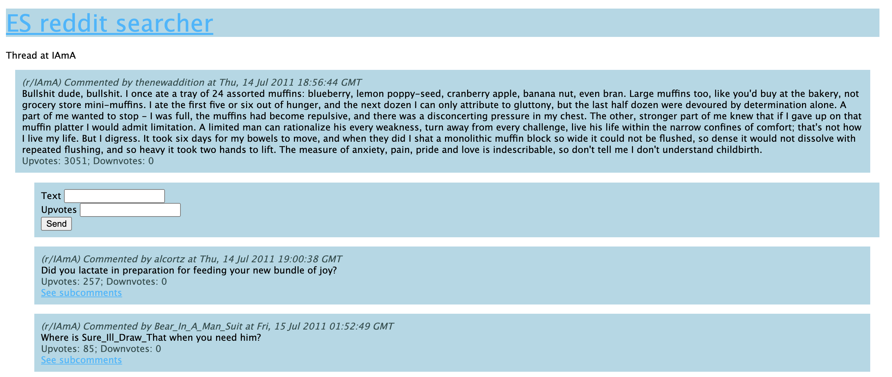

# Elasticsearch
Elasticsearch (ES) is an analytics engine that supports querying multiple types of data. It's distributed, free and opensource. It uses *Apache Lucene* internally as a search engine. It's accessible via REST API and is provided with a set of tools branded as Elastic Stack, with most popular of them being Logstash and Kibana. And most importantly, it was designed to reduce costs of performing queries and data-analysis tasks on big sets of data - both the infrastructural cost and the 

## Limitations of elasticsearch
Despite its adventages in querying performance and convenience, elasticsearch is not a great choice as an only database for real-life, business application. It does not feature transactions nor rollbacks. It's not real-time, that means that the data may be available even after over 1 second. Elasticsearch also may lose its data in some scenarios. Therefore, every team introducing elasticsearch to their stack must be aware of these limitations and address them thoroughly. ES is not an ACID database and should not be treated as such, meaning no business logic requiring consistency and security should be built solely upon it.

## The project idea
During this project, we intend to show how to make a relational database (postgresql) work together with ElasticSearch and what are the benefits of doing that. The approach we will use is often described as data redundancy. That means that we will be persisting data both in a database more suited for safe persistence, and in the elasticsearch.  
We will be working on the example app in the [app](../source/app) source folder. We plan to focus on the process of introducing advanced search and data-analysis features to a very basic reddit-like website. In the process of benchmarking and implementing the features, we used [this reddit comments dataset](https://files.pushshift.io/reddit/comments/) that provided us with 10 million data entries.

## The application
The application that we will be working on is a very basic reddit-like website. It has the following features: 
 * viewing top reddit comments
 * navigating to their subcomments
 * writing our own comments
During this article we will add data analysis features that will allow us to query this massive dataset in a couple of handy ways. 

### App structure
The app consists of the following parts:
 - repositories (`source/app/repositories`)
 - services (`source/app/services`)
 - routes (`source/app/routes`)
 - views (`source/app/views`)

Each fo these parts have their own responsibilities. `Repositories` store the database logic and configuration, including querying and inserting new data to PostgreSQL and ElasticSearch. `Services` implement the business logic of the application. `Routes` define how the http api of the application behaves. `Views` consits of `jade` templates defining the views that then get rendered to `html` files. 

### Data structure
Each reddit comment consists of the following fields:
 - `subreddit` - where the comment came from
 - `author` - nickname of the comment's author
 - `body` - comment body
 - `parent_id` - what article/comment this comment is refering to
 - `name` - unique url identifier that will be used by us a primary key
 - `created_utc` - when the comment was created

### Initial application endpoints
Below is the list of the endpoints of the basic application, not including the search endpoints that will be added in the process presented in this project.

#### GET /
Returns view of main page of the website, it can be used to navigate to top comments.

#### GET /comments/top?after=:n
Returns view of list of comments with the most upvotes. It has an option `after` query parameter that is used to paginate the results.

#### GET /comments/t/:parent_id
Returns view of the parent comment with `name=:parent_id` and list of its subcomments

#### POST /comments/t/:parent_id
Adds a new subcomment to the `parent_id` comment.

### Usage of PostgreSQL in the app
We used the `pg` and `pg-promise` libraries to operate on the PSQL database. Using it requires creating a connection pool:
```
const pool = new Pool({
  user: 'reddit',
  host: 'localhost',
  database: 'reddit',
  password: '',
  port: 5432,
});
```
That can be then accessed with `pool.query` method to perform queries using this connection pool. The basic queries that the app is performing are:

#### Fetching top comments
```
async function fetchTopComments(limit, offset) {
  return await (await pool.query(`
    SELECT * FROM reddit_data ORDER BY ups DESC 
    LIMIT ${limit} OFFSET ${offset}`)).rows;
}
```
It also features basic pagination with `LIMIT` and `OFFSET` keywords.

#### Fetching single comment
```
async function fetchComment(threadId) {
  return await (await pool.query(
      `SELECT * FROM reddit_data WHERE name='${threadId}'`
  )).rows;
}
```

#### Fetching comments for a thread with given id
```
async function fetchCommentsForThread(threadId, limit = 20) {
  return await (await pool.query(
      `SELECT * FROM reddit_data WHERE parent_id='${threadId}' 
      ORDER BY ups DESC LIMIT ${limit}`
  )).rows;
}
```

#### Persisting a new comment
```
async function persistComment(subreddit, author, createdAt, body, ups, parentId) {
  let randomId = uuid.v4().replace('-', '');
  await pool.query(`INSERT INTO reddit_data 
    (name, subreddit, subreddit_id, author, edited, controversiality, 
    created_utc, body, ups, downs, score, parent_id, archived) 
    VALUES ('${randomId}', '${subreddit}', '${subreddit}', '${author}', 'false', 
    '0', '${createdAt}', '${body}', '${ups}', 0, '${ups}', '${parentId}', 'false')
  `)
  console.log("inserted")
}
```
It uses a random v4 UUID trimmed of dashes as id for the new entry.


### App interface
Interface of the app is very simple, below are a few screenshots:

#### /


#### /comments/top


#### /comments/t/:thread_id

