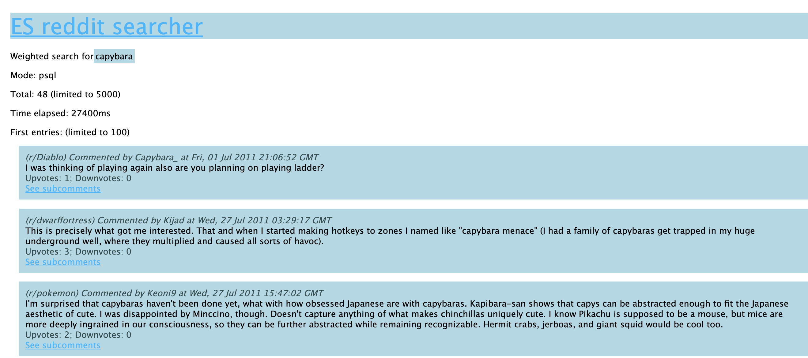

# Implementing and benchmarking complex searching

## Full-text search
Full-text searching features allow us to search for a specific term (or similiar ones) in the text content. In our case, we want to search for a given term (or terms) in the comments. In our application, we want to create a new endpoint that will allow us a full text search on the full set of entries:

```GET /search/textSearch?string=:searchString```
### Basic PostgresSQL approach
```
async function textSearchPsql(searchString) {
  return await (await pool.query(
    `SELECT * FROM reddit_data 
      WHERE body LIKE '%${searchString}%' LIMIT 5000`
  )).rows;
}
```
Above function uses basic `LIKE` syntax. This function was introduced by us in the `searchRepository`, and then accessed from views via services. However, that naive approach can't be used in the production. Firstly, it does not behave as we want it to. It only matches comments that include `searchString` literally inside of them. For example, given search string `i love bananas` and the comment body `i love all bananas` there would be no match, and that's not the behaviour we want. Secondly, the performance of this solution is very, very bad.

#### Benchmarks
| Search string | Returned entries (5000 limit) | Time    |
|---------------|-------------------------------|---------|
| bananas       | 5000                          | 24581ms |
| capybara      | 38                            | 33080ms |
| i love you    | 765                           | 24138ms |

### Elasticsearch approach
In contrast to the naïve PostgreSQL `LIKE` approach, the Elasticsearch gives us everything out of the box. The search is fuzzy, so query `i love bananas` would match `i lve bananas`. It treats the terms separately, so it will work easily for strings like `i love all bananas`. And last, but not the least, it's a lot faster.

```
function extractSearchBodies(hits) {
  return hits.map(extractSearchBody);
}

function extractSearchBody(hit) {
  return hit._source
}

async function textSearchElastic(searchString) {
  const { body } = await esClient.search({
    index: 'reddit_data',
    size: 5000,
    body: {
      query: {
        match: {
          body: searchString
        }
      }
    }
  })
  return extractSearchBodies(body.hits.hits);
}
```
Due to the response structure, we had to extract it using the `extractSearchBodies` function. The query is very simple and is the essence of what ES was designed to do.

#### Benchmarking
| Search string | Returned entries (5000 limit) | Time   |
|---------------|-------------------------------|--------|
| bananas       | 4757                          | 1264ms |
| capybara      | 40                            | 57ms   |
| i love you    | 5000                          | 2722ms |

We can see a massive level of performence improvement. In the case of terms that do not appear often (`capybara`) the performance difference is 3 orders of magnitude. We also see difference in number of returned entries. It is due to the algorithm of calculating `score` for the searched terms - entries are returned if the resulting score lands over a given threshold.

### PostgreSQL Text Search Vector
However, the approach we used in PostgreSQL is too naive. There is a feature for full text search in PostgreSQL and to make a fair comparasion we will implement it as well. Fast full-text searches in PostgreSQL are based on text search vectors (tsvector) that store the text fields as vectors of terms that is then stored in sorted form allowing fast traversal. 

As a first step we have to create a GIN for `body` tsvectors index (in order to have the tsvectors prepared before requests):
```
CREATE INDEX body_tsv_index ON reddit_data
    USING gin(to_tsvector('simple',body));
```
First observation is that this operation was very slow. It took over 20 minutes to complete, but now we can write an efficient full-text search query using postgresql:
```
async function textSearchPsqlTsv(searchString) {
  return await (await pool.query(
    `SELECT * FROM reddit_data 
      WHERE to_tsvector('simple', body) @@ to_tsquery('''${searchString}''')
      LIMIT 5000`
    )).rows;
}
```
`@@` operator executes a given query on a tsvector. Above code will search for the `searchString` in the tsvectors created for `body` fields.

#### Benchmarking

| Search string | Returned entries (5000 limit) | Time  |
|---------------|-------------------------------|-------|
| bananas       | 4726                          | 726ms |
| capybara      | 40                            | 20ms  |
| i love you    | 5000                          | 352ms |

The PostgreSQL TSV is the fastest approach. However, we think that there is an important reason to it being so fast - it's just much simpler than the ElasticSearch scoring. It still does not fullfill all of our expectations - it just checks if the given terms are included in the text search vectors. ElasticSearch model would still give us results that would help us build much better full-text search function to offer to the app's users. And it's also much simpler in terms of the written code and preparations.

### UI screenshots


## Custom regexp search
Regexp search can be used to find given patterns in data sets. It can be particularly useful in finding emails, phone numbers, addresses and other structured data in text content. However, completing regexp searches in real time can be a demanding task. We created a new endpoint and a view available at:
```GET /search/regexSearch?string=:regexpString```

### PostgreSQL approach
PostgreSQL offers `~` operator that returns a boolean value that denotes whether a given string matches the regexp. Using this syntax we can define a regexp search function in node:
```
async function regexSearchPsql(regex) {
  return await (await pool.query(
    `SELECT * FROM reddit_data 
      WHERE body ~ '${regex}'
      LIMIT 5000`
    )).rows;
}
```
This function will return all comments where the comment's body matches the given regular expression. 

#### Benchmarking

Below are the results of testing this method. The last regexp is a simple expression for short emails.

| Search regexp                            | Returned entries (5000 limit) | Time    |
|------------------------------------------|-------------------------------|---------|
| `colou?r`                               | 5000                          | 2686ms  |
| `ni{2,5}ce`                                | 144                           | 29746ms |
| `[a-zA-Z0-9]{1,10}@[a-zA-Z0-9]{1,10}\.com` | 2639                          | 40808ms |


### Elasticsearch approach
Elastic search offers an out of the box feature of regexp matching. It can by accessed by a `regexp` query. ES offers additional options for regex matching:

 - `flags` allows to enables additional features and syntax for writing regular expressions, for examples `<a-b>` syntax for numeric ranges
 - `max_determinized_states` limits amount of states in the finite automaton generated in order to match the query. It's particullarly useful for limiting complexity of the queries entered by app's users.
 - `rewrite` determines how the ES will rewrite the query to make it possible to calculate a score for it.

```
async function regexSearchElastic(regex) {
  const { body } = await esClient.search({
    index: 'reddit_data',
    size: 5000,
    body: {
      query: {
        regexp: {
          body: {
            value: regex,
            flags: 'ALL',
            case_insensitive: true,
            max_determinized_states: 10000,
            rewrite: 'constant_score'
          }
        }
      }
    }
  })
  return extractSearchBodies(body.hits.hits);
}
```

#### Benchmarking

| Search regexp                            | Returned entries (5000 limit) | Time   |
|------------------------------------------|-------------------------------|--------|
| `colou?r`                                  | 5000                          | 2202ms |
| `ni{2,5}ce`                                | 377                           | 277ms  |
| `[a-zA-Z0-9]{1,10}@[a-zA-Z0-9]{1,10}\.com` | 5000                         | 1183ms |

Once again, ElasticSearch provided much better and consistent performance. It's noticable that it even returned more entries for some of the expressions. It is due to the same mechanism that was present in the previous part about the full-text search. ES queries are rewritten in a way to be fuzzy, so queries that are similiar to the pattern, but not necessairly matching, are also returned.

### UI screenshots


## Weighted search
Very useful type of searching complex text data is a weighted search. Given a couple of fields, we often want to find if any of these fields contain a given string. What's more, we often want to favor some fields over other. That's when the weighted search is useful. It allows to perform a full-text search in a couple of fields and base scoring on a weighted scores of subqueries performed per field. In our case, we want to search for a given string in:

 - `author` with weight equal to 10 
 - `body` with weight equal to 4 
 - `subreddit` with weight equal to 2 

The most important to us is a case when the author name matches the string, then the comment body, and then subreddit name. We created an endpoint that allows querying and presents a view of the weighted search results:
```GET /search/weightedSearch?string=:regexpString```

### PostgreSQL TSV approach
In PostgreSQL we can once again utilize `text search vectors` and create a new field `tsv` that will contain the `tsvector` values that will be used in this query:
```
ALTER TABLE reddit_data ADD COLUMN tsv tsvector;

UPDATE reddit_data SET tsv =
   setweight(to_tsvector(author), 'A') ||
   setweight(to_tsvector(body), 'B') ||
   setweight(to_tsvector(subreddit), 'C') WHERE 0=0;
```
The `A, B, C` letters denote the weight of the vector elements. Default values of these weights are matching the 10:4:2 ratio, so we do not need to adjust it further. What's important to note, these queries took **over 40 minutes** to execute. What's more, during the execution of above queries, the following error appeared over a 100 of times:
```[54000] word is too long to be indexed``` 
This means that not all the comments are searchable, because some of them were too long to create a tsv vectors out of them. Now, we can execute a `SELECT` query utilising the new `tsv` field, just like we did in the `full text search` part. However, this time we  need to order the entries by the tsv rank that is calculated by the `ts_rank_cd` method by matching given terms to each term of the created tsv field, and then returning the weighted count of matches.
```
async function weightedSearchPsqlTsv(searchString) {
  return await (await pool.query(
    `SELECT *, ts_rank_cd(tsv, query) AS rank
      FROM reddit_data, to_tsquery('''${searchString}''') query
      WHERE query @@ tsv
      ORDER BY rank DESC
      LIMIT 5000`
    )).rows;
}

```
SELECT *, ts_rank_cd(tsv, query) AS rank
FROM reddit_data, to_tsquery('''${searchString]''') query
WHERE query @@ tsv
ORDER BY rank DESC
LIMIT 5000

#### Benchmarking

| Search string | Returned entries (5000 limit) | Time    |
|---------------|-------------------------------|---------|
| bananas       | 5000                          | 28044ms |
| capybara      | 48                            | 28608ms |
| i love you    | 5000                          | 458ms   |
Once again, the queries took very long to execute and no user would want to wait that much to see their search results.

### Elasticsearch approach

Weighted search is another feature that is provided out of the box in elasticsearch. For a query of type `query_string` we have to specify `fields` that will be matched against. If we provide their names with `^` and a number next to them, they will interpreted as having a weight equal to the given number. 
```
async function weightedSearchElastic(searchString) {
  const { body } = await esClient.search({
    index: 'reddit_data',
    size: 5000,
    body: {
      query: {
        query_string: {
          query: searchString,
          fields: [
            "author^10.0",
            "body^4.0",
            "subreddit^2.0"
          ]
        }
      }
    }
  })
  return extractSearchBodies(body.hits.hits);
}
```
The code is very simple and requires no setup and additional indexing at all.

#### Benchmarking

| Search string | Returned entries (5000 limit) | Time   |
|---------------|-------------------------------|--------|
| bananas       | 2551                          | 1323ms |
| capybara      | 40                            | 28ms   |
| i love you    | 5000                          | 2604ms |
These results are much better than in the postgresql TSV approach and can be considered real-time. 

### Additional thoughts
Postgresql TSV approach is not capable of providing dynamic weights for the queries. The queried field must be prepared before querying, and it can take a very long time. For our dataset consisting of 10 million entities, it took over 40 minutes. For more entries, it would probably get linearly worse. However, using ElasticSearch, we were able to execute dynamic queries on arbitrary fields in much shorter time.

### UI screenshots




## Searching in recent comments
Another great example of flexibility of ElasticSearch querying mechanism is its ability to search based on multiple conditions and mix their scores. Let's say we were given a task of implementing a feature that would allow our users to search in the recent comments for a given term. In this part we implemented a ES querying function that performs this operation.

### `function_score` query
`Function score query` is another type of query in elasticsearch that makes it possible to build a complex query that integrates a couple of subqueries, while allowing a custom scoring combination algorithm. The most important fields of this query type are:

 - `score_mode` that specifies how the scoring is combined for all of the queries.
 - `functions` that allow specifying additional functions used in the querying (their score is then combined using `score_mode`)
 - `query`, the query to be combined with queries in `functions`

### Decay functions
Decay functions score entries with a function that returns a value depending on a distance of a numeric field from the given origin. We can specify a distribution that will be used to calculate the distance, for example the `gaussian` distribution. That's exactly what we want to use in our feature - we want to take the most recent posts. Below is the gaussian decay function that we will be using to fetch the recent posts.
```
gauss: {
  created_utc: {
    origin: date,
    scale: "10d",
    decay: 0.5,
    offset: "2d"
  }
},
```
The above snippet says that we want to match the `created_utc` field against the provided `date` with a gaussian distribution calculated based on the provided values. The resulting distribution is best described with the following image:


By combining the gaussian decay function and a simple string matchin with a `multiply` score_mode, we get exactly what we wanted to achieve - a scoring algorithm returning a product of the string match score and the gaussian decay score:

```
async function recentSearchElastic(date, searchString) {
  const { body } = await esClient.search({
    index: 'reddit_data',
    size: 5000,
    body: {
      query: {
        function_score: {
          functions: [
            {
              gauss: {
                created_utc: {
                  origin: date,
                  scale: "10d",
                  decay: 0.5,
                  offset: "5d"
                }
              },
            }
          ],
          score_mode: "multiply",
          query: {
            match: { body: searchString },
          }
        }
      }
    }
  })
  return extractSearchBodies(body.hits.hits);
}
```

### Benchmark

| Search string | Date       | Returned entries (5000 limit) | Time   |
|---------------|------------|-------------------------------|--------|
| bananas       | 2011-07-14 | 2551                          | 549ms  |
| capybara      | 2011-08-21 | 40                            | 25ms   |
| i love you    | 2011-05-19 | 5000                          | 1961ms |
Once again, the queries were fast and there would be no problem with providing the users with this feature.

### UI screenshots


